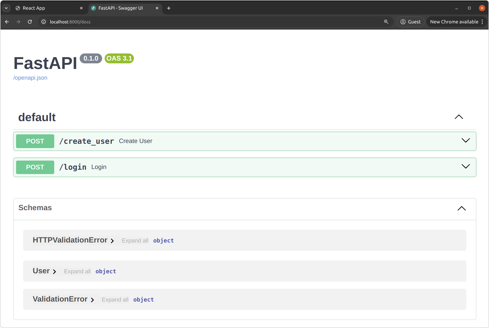

# Pre-screening Assignment
This repository contains a pre-screening assignment/problem statement designed to evaluate a candidate's skills in Linux, DevOps, Docker, and troubleshooting.

------
------

## *Assignment Overview:*

> This assignment requires the candidate to set up a full-stack application that consists of a frontend and a backend component, with a PostgreSQL database. The goal is to demonstrate your ability to configure, run, and connect different services using Docker.


### Instructions:

> ### Clone the Repository:

- Start by cloning this repository to your local machine.
```
git clone <repository-url>
cd <repository-folder>
```
- Create a New Branch:

Create a new branch in the following format:
```
git checkout -b solutions-{your-name}
```
> ### Project Structure:


The application is located in the `assignment/` directory, which contains two main components:
- Backend: Located in the `backend/` folder.
- Frontend: Located in the `frontend/` folder.

- Environment Variables:

    Create the necessary .env file required for the services to run properly. Ensure that you include all the required environment variables.

> ### Docker Setup:

Each folder contains its respective Dockerfile named appropriately. *You will need to make adjustments/troubleshoot to ensure everything works seamlessly.*
The backend should work with a PostgreSQL database for full functionality.

- Run PostgreSQL Database:

> You need to run the PostgreSQL database in a Docker container along with the backend and frontend services.
Using Docker Compose or

> You need to run all the applications along with the PostgreSQL in container.

- Creating a docker compose YML file

> ### Accessing the Application:

Once all services are running:
- The frontend should be accessible at http://localhost:3000.


- The backend (FastAPI) should be accessible at http://localhost:8000/docs for the Swagger UI.


- PostgreSQL should be running on its default port 5432.

> ### User Interface:

The frontend should prompt you for signup and login operations.
After successful operations, the UI should provide appropriate feedback messages.


> ## Documentation and Submission:

- Capture a `screen-recording` or take `screenshots` of all the activities above, including running the services, accessing the frontend and backend, and user interactions and share the same recorded files/screenshots over Google Drive.

- Commit all your code changes to your created branch as instructed above.

- After commiting changes, copy the branch name (along with GitHub URL, and Google Drive URL) and share the same over the screening mail received on your email.
